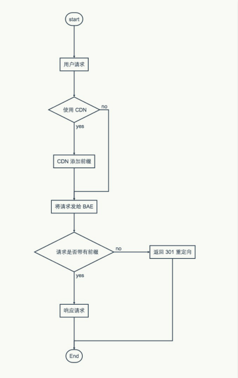

#### **背景**

* 如果域名未备案，在国内基本无法使用
* 同时国内 VPS 的高价低配，于是找到了相对最便宜的 `应用云擎(BAE)基础版` 作为备案的基础
* 但是 BAE 不支持 HTTPS，并且不能控制单一域名对外

#### **需求**

* 方案要保证备案不被注销
* 能够相对低廉、稳定地使用 HTTPS、H2
* HTTP 请求要重定向到 HTTPS 请求
* 不能存在除 `qiujun.me` 以外的域名访问博客

#### **实现**

* 又拍云支持 HTTPS 与 H2，并且可以开启强制 HTTPS，这里解决了 HTTPS 的问题
* 同时又拍云支持自定义 Rewrite，可以用 Rewrite 标注这是来自 UPYUN 的请求
* BAE 接收到请求后，判断请求来自又拍云就接受，否者返回重定向，以此保证入口的唯一性
* 同时将 `www.qiujun.me` 域名解析到百度云，用来通过百度云的备案检查，保证备案不被注销

<!-- more -->

#### **流程**



#### **步骤**

> **下面以 qiujun.me 相关域名作为样例**
> **同时以 qiujun.duapp.com 用来表示 BAE 分配的二级域名**

##### **对 BAE 的处理**

* 注册 `BAE` 并创建应用，由于只是用来放静态博客及保留备案，这里选择最便宜的，大概 3 元一个月


* 在 BAE 的 Git 仓库根目录下 app.conf 的内容如下：

```
handlers:
  - url : ^\/cdn\/(.*)$
    static_files : /$1
  - url : ^(.*)$
    static_files : /redirect.html
```
这里将 `/CDN` 前缀作为标注，标注这是来自UPYUN的请求
也就是当请求路劲带有前缀 `/CDN` 则响应正常请求，否则发送重定向页面

* 在 BAE 的 Git 仓库根目录下添加重定向页面 redirect.html ，内容与下面类似

```html
<script language="javascript"type="text/javascript">
  var origin = 'https://qiujun.me';
  var pathname = window.location.pathname;
  var search = window.location.search;
  window.location.href = origin + pathname + search;
</script>
```

* 然后将 `www.qiujun.me` CNAME 解析到 `qiujun.duapp.com`，过一段时间可以看到类似的图片（假定在百度云备案已经完成）


这一步主要用于保留备案，防止被监测说域名未接入 BAE。由于都是直接接入 BAE ，所以 `www.qiujun.me` 和 `qiujun.duapp.com` 访问效果一致，都会是页面重定向

##### **对 UPYUN 的处理**

* 注册 `又拍云` 并创建服务，选择回源方式，回源地址填写 `www.qiujun.me` 或 `qiujun.duapp.com`
* 进入相应服务配置页，先绑定域名，绑定 `qiujun.me`
* 由于需要开启 HTTPS/H2，所以点击右上角 `工具箱` > `SSL 服务` > `添加 SSL 证书` 并添加
* 接下来继续进入服务配置页，分别点击 `高级设置` > `自定义 Rewrite`
* 由于 UPYUN 默认提供二级域名，所以这里先设置 Rewrite ，将二级域名的请求重定向到自己的域名

```txt
$WHEN($NOT($EQ($_HOST, qiujun.me)))$REDIRECT($_SCHEME://qiujun.me$_URI$PCALL(?$_QUERY), 301)
```
这段代码的意思是，当访问的域名不是 `qiujun.me` 时，就进行 `301` 重定向到 `qiujun.me` 域名

* 接下来配置联合 BAE 的 Rewrite，这条很简单

```txt
/cdn$_URI
```

* 然后保存


到这里所有的步骤就都完成了

#### **其他问题**

##### CNAME 与 MX 记录共存问题

* 通过上面的介绍也看到了， qiujun.me 是 CNAME 到 UPYUN 的，而我的邮箱 i@qiujun.me ，您可能会问是否冲突
> 答：CNAME 与 MX 是不能共存的，这里是通过 CloudXNS 的 Link 记录实现的，我这边是将 blog.qiujun.me 域名 CNAME 到又拍云的 xxx.b0.aicdn.com. ，然后将 qiujun.me LINK 到 blog.qiujun.me ，这样就可以对 qiujun.me 使用 MX 记录了
